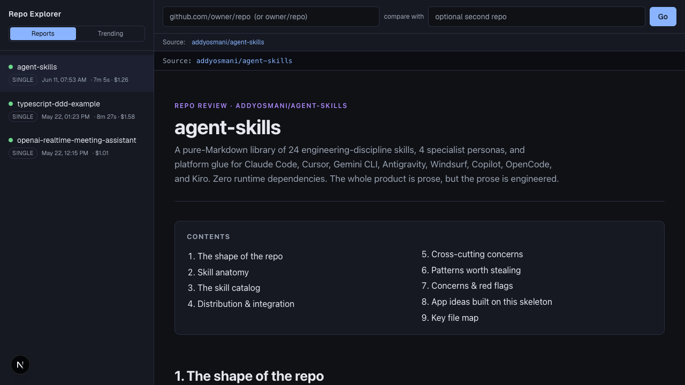

# Repo Explorer

A local web GUI around the `explore-repo` skill. Paste one or two GitHub URLs, hit
**Go**, and it generates a self-contained HTML architectural review — then keeps an
index of past reports you can browse in the sidebar.

It runs the skill **headlessly** via the local [Claude Agent SDK]
(`@anthropic-ai/claude-agent-sdk`): the agent shallow-clones each repo to a temp
dir, an Explore subagent reads it, and a single HTML report is written to
`data/reports/`. The clone is always discarded.

This is a **local-only** app. It shells out to `git` and runs an agent on your
machine, so don't expose it publicly.

> [!WARNING]
> Analysis is token and resource intensive. Each review runs on your own
> Anthropic API key. See the per-run costs in the sidebar of the screenshot below.



## Requirements

- Node 20.9+ and `git` on your PATH
- One of: a **Claude Pro/Max subscription** (recommended — runs on your plan) or an
  **Anthropic API key** (pay-per-token)

## Quick start

Three steps, all in the terminal — no editor required.

**1. Get into the repo:**

```bash
git clone https://github.com/<you>/repo-explorer.git
cd repo-explorer
```

**2. Run the launcher:**

```bash
pnpm launch
```

**3. Pick how to authenticate when prompted — and you're done.**

`pnpm launch` offers two options:

- **Claude subscription (Pro/Max)** — recommended. It runs `claude setup-token`,
  you log in, and it stores a token that draws on your plan (no metered billing).
- **Anthropic API key** — pay-per-token; paste your `sk-ant-…` key.

That's it. `pnpm launch` does the rest: checks prerequisites, installs dependencies,
writes `.env.local`, starts the dev server, and opens http://localhost:3000.

> Only one method is active at a time. To **switch** (e.g. your API key is capped, or
> your subscription is exhausted), just re-run `pnpm launch`, pick the other, and
> restart the dev server. The credential lives in gitignored `.env.local` and never
> leaves your machine.

**Run it again any time.** Once set up, `pnpm launch` skips straight to launching.
It's also port-aware: if something is already on port 3000 it works out whether
that's an existing Repo Explorer (and just points you at it) or another process (and
offers to kill it or pick a different port) — so you never end up with duplicate
instances scattered across ports.

Then enter `owner/repo`, a full `https://github.com/owner/repo` URL, or two repos to
compare. Progress streams live; finished reports render in a sandboxed iframe and
appear in the sidebar.

## Manual setup

If you'd rather wire it up by hand instead of using `pnpm launch`:

```bash
pnpm install
cp .env.example .env.local   # then set ONE credential in .env.local
```

`.env.local` — set exactly one:

```
# Subscription (recommended): mint with `claude setup-token`
CLAUDE_CODE_OAUTH_TOKEN=...
# …or an API key:
ANTHROPIC_API_KEY=sk-ant-...
```

```bash
pnpm dev         # http://localhost:3000
# or
pnpm build && pnpm start
```

## How it works

```
Browser ─ POST /api/jobs ─────────────► start an in-process job (up to 3 at once)
        ─ GET  /api/jobs/[id]/events ──► SSE stream of progress
        ─ GET  /api/reports ──────────► list from data/index.json
        ─ GET  /api/reports/[id] ─────► serve data/reports/<id>.html
job runner ─► Agent SDK query() ─► loads .claude/skills/explore-repo ─► report
```

- `lib/analyze.ts` — wraps the Agent SDK `query()` call.
- `lib/jobs.ts` — in-process job registry + queue, streams progress events.
- `lib/store.ts` — `data/index.json` manifest + report files.
- `.claude/skills/explore-repo/` — **vendored copy** of the canonical skill from
  `~/.claude/skills/explore-repo/`. Re-copy it to pick up upstream changes.

## Notes

- Reports and the index live under `data/` and are gitignored.
- If the process restarts mid-job, that job is lost (acceptable for a local app);
  completed reports persist on disk.

## Status

**Last shipped:**
- Bookmarks — a third sidebar view. Bookmark a repo from the Trending triage modal or any repo card to revisit later without analyzing; the Bookmarks view mirrors Trending (same cards, Analyze/triage flow) and supports unbookmarking. Persisted in localStorage (`repo-explorer:bookmarks`), shared across views via the `useBookmarks` hook (`lib/bookmarks.ts`). Trending and Bookmarks now render through a shared `RepoCard`.
- Steering from triage — the Trending triage modal now has an "Additional instructions" input, so you can focus the analysis (e.g. "only the auth layer") before hitting Analyze. Backend already threaded `steeringText` end-to-end; this exposed it on the Trending path.
- Triage modal on Trending tab — clicking Analyze shows a GitHub API preview (stars, language, README excerpt, activity verdict) before committing tokens. Analysis starts silently in the background; user stays on Trending. "Not interested" dismisses to a collapsible section, persisted in localStorage.
- Stop button — cancel a running analysis mid-stream via AbortController.
- Model selector — choose Opus / Sonnet / Haiku per analysis from the form.

**Up next:** see [open issues](https://github.com/joshcoolman/repo-explorer/issues)
